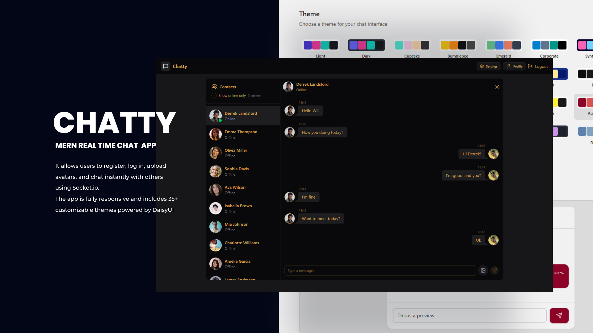

# Chatty 💬

A **MERN Real-Time Chat Application** with user authentication, customizable themes, avatar uploads, and instant messaging using **Socket.IO**.  
The app is fully responsive and styled with **Tailwind CSS** + **DaisyUI**, offering more than **35 different themes** to personalize the experience.

🌐 Live Demo: [Chatty on Render](https://chatty-66mz.onrender.com/)



---

## ✨ Features

- 🔐 **Authentication** – Register & Login with JWT-based authentication.
- 💬 **Real-Time Messaging** – Instant chat powered by **Socket.IO**.
- 🎨 **Themes** – Choose from **35+ DaisyUI themes**.
- 🖼 **Profile Avatars** – Upload & update your profile picture (Cloudinary integration).
- 📱 **Responsive Design** – Works seamlessly on desktop and mobile.
- ⚡ **Fast UI** – Built with **React + Vite + Tailwind CSS**.
- 🗂 **State Management** – Powered by **Zustand**.

---

## 🛠 Tech Stack

### Frontend

- **React 19**
- **Vite**
- **TypeScript**
- **Tailwind CSS + DaisyUI**
- **Zustand** (state management)
- **React Router**
- **React Hook Form + Zod** (form validation)
- **React Toastify** (notifications)
- **Socket.IO Client**

### Backend

- **Node.js + Express**
- **TypeScript**
- **MongoDB + Mongoose**
- **Socket.IO**
- **JWT Authentication**
- **Bcrypt.js** (password hashing)
- **Cloudinary + Multer** (avatar uploads)
- **CORS, Dotenv, Cookie-Parser**

---

## 🚀 Getting Started

### 1. Setup .env file

```bash
NODE_ENV=development
PORT=3000
MONGO_URI=your_mongodb_connection_string
JWT_SECRET=your_jwt_secret
CLOUDINARY_CLOUD_NAME=your_cloudinary_name
CLOUDINARY_API_KEY=your_cloudinary_key
CLOUDINARY_API_SECRET=your_cloudinary_secret
```

### 2. Build project

```bash
  npm run build
```

### 3. Start project

```bash
  npm start
```
